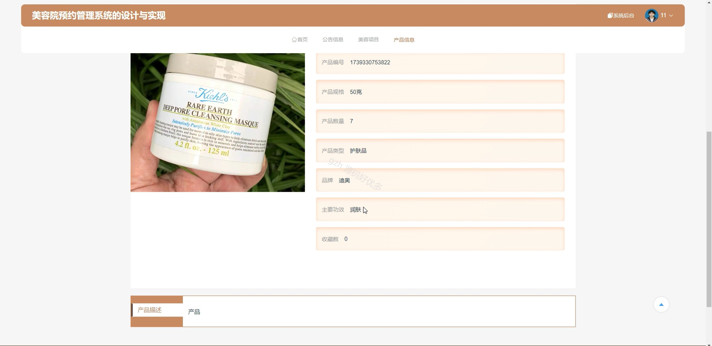

# springbootA178D
springbootA178D美容院预约管理系统+LW+PPT
 
## 查看主页获取源码

### 一、关键词
美容信息管理、美容产品信息、美容项目管理

### 二、作品包含
源码+数据库+设计文档万字+ppt+全套环境和工具资源+本地部署教程

### 三、项目技术
前端技术：Html、Css、Js、Vue3.0、Element-ui 
后端技术：Java、SpringBoot3.0、MyBatis

### 四、运行环境（以下版本亲测，其他版本未知，请自测）
开发工具：IDEA/eclipse  + VSCODE

数据库：MySQL5.7（最低要5.7版本）

数据库管理工具：Navicat10以上版本

环境配置软件： JDK17 + Maven3.6.3

前端Nodejs：20

浏览器：谷歌浏览器

### 五、项目介绍
项目编号：springbootA178D

美容院预约管理系统可高效管理客户信息，提升运营效率与客户体验。

角色：管理员、用户、美容师

用户功能：注册登录、首页、公告信息、美容项目、产品信息、个人中心、修改密码、美容信息管理、充值信息、消息推送、我的收藏。

美容师功能：注册登录、统计分析、美容信息管理、产品信息管理、考勤信息管理、床位信息管理。

管理员功能：统计分析、管理员管理、会员管理、美容信息管理、产品信息管理、充值信息管理、考勤信息管理、消息推送管理、床位信息管理、公告信息管理。

### 六、运行截图

